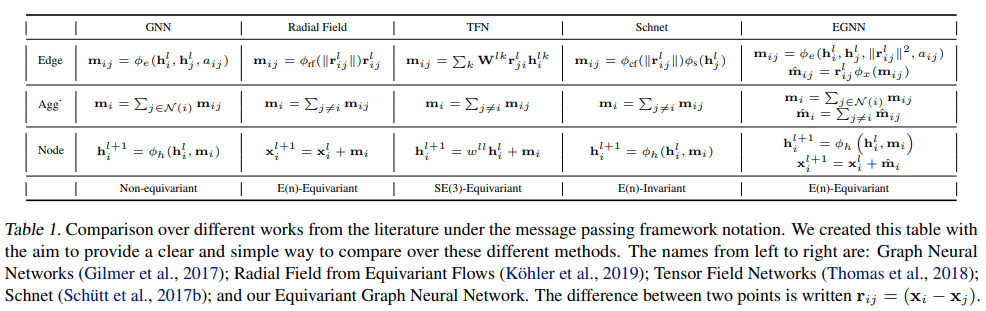

</img>

** A bug has been discovered with the neighbor selection in the presence of masking. If you ran any experiments prior to 0.1.12 that had masking, please rerun them. 🙏 **

## EGNN - Pytorch

Implementation of <a href="https://arxiv.org/abs/2102.09844v1">E(n)-Equivariant Graph Neural Networks</a>, in Pytorch. May be eventually used for Alphafold2 replication. This technique went for simple invariant features, and ended up beating all previous methods (including SE3 Transformer and Lie Conv) in both accuracy and performance. SOTA in dynamical system models, molecular activity prediction tasks, etc.

## Install

```bash
$ pip install egnn-pytorch
```

## Usage

```python
import torch
from egnn_pytorch import EGNN

layer1 = EGNN(dim = 512)
layer2 = EGNN(dim = 512)

feats = torch.randn(1, 16, 512)
coors = torch.randn(1, 16, 3)

feats, coors = layer1(feats, coors)
feats, coors = layer2(feats, coors) # (1, 16, 512), (1, 16, 3)
```

With edges

```python
import torch
from egnn_pytorch import EGNN

layer1 = EGNN(dim = 512, edge_dim = 4)
layer2 = EGNN(dim = 512, edge_dim = 4)

feats = torch.randn(1, 16, 512)
coors = torch.randn(1, 16, 3)
edges = torch.randn(1, 16, 16, 4)

feats, coors = layer1(feats, coors, edges)
feats, coors = layer2(feats, coors, edges) # (1, 16, 512), (1, 16, 3)
```

A full EGNN network

```python
import torch
from egnn_pytorch import EGNN_Network

net = EGNN_Network(
    num_tokens = 21,
    num_positions = 1024,           # unless what you are passing in is an unordered set, set this to the maximum sequence length
    dim = 32,
    depth = 3,
    num_nearest_neighbors = 8,
    coor_weights_clamp_value = 2.   # absolute clamped value for the coordinate weights, needed if you increase the num neareest neighbors
)

feats = torch.randint(0, 21, (1, 1024)) # (1, 1024)
coors = torch.randn(1, 1024, 3)         # (1, 1024, 3)
mask = torch.ones_like(feats).bool()    # (1, 1024)

feats_out, coors_out = net(feats, coors, mask = mask) # (1, 1024, 32), (1, 1024, 3)
```

Only attend to sparse neighbors, given to the network as an adjacency matrix.

```python
import torch
from egnn_pytorch import EGNN_Network

net = EGNN_Network(
    num_tokens = 21,
    dim = 32,
    depth = 3,
    only_sparse_neighbors = True
)

feats = torch.randint(0, 21, (1, 1024))
coors = torch.randn(1, 1024, 3)
mask = torch.ones_like(feats).bool()

# naive adjacency matrix
# assuming the sequence is connected as a chain, with at most 2 neighbors - (1024, 1024)
i = torch.arange(1024)
adj_mat = (i[:, None] >= (i[None, :] - 1)) & (i[:, None] <= (i[None, :] + 1))

feats_out, coors_out = net(feats, coors, mask = mask, adj_mat = adj_mat) # (1, 1024, 32), (1, 1024, 3)
```

You can also have the network automatically determine the Nth-order neighbors, and pass in an adjacency embedding (depending on the order) to be used as an edge, with two extra keyword arguments

```python
import torch
from egnn_pytorch import EGNN_Network

net = EGNN_Network(
    num_tokens = 21,
    dim = 32,
    depth = 3,
    num_adj_degrees = 3,           # fetch up to 3rd degree neighbors
    adj_dim = 8,                   # pass an adjacency degree embedding to the EGNN layer, to be used in the edge MLP
    only_sparse_neighbors = True
)

feats = torch.randint(0, 21, (1, 1024))
coors = torch.randn(1, 1024, 3)
mask = torch.ones_like(feats).bool()

# naive adjacency matrix
# assuming the sequence is connected as a chain, with at most 2 neighbors - (1024, 1024)
i = torch.arange(1024)
adj_mat = (i[:, None] >= (i[None, :] - 1)) & (i[:, None] <= (i[None, :] + 1))

feats_out, coors_out = net(feats, coors, mask = mask, adj_mat = adj_mat) # (1, 1024, 32), (1, 1024, 3)
```

## Edges

If you need to pass in continuous edges

```python
import torch
from egnn_pytorch import EGNN_Network

net = EGNN_Network(
    num_tokens = 21,
    dim = 32,
    depth = 3,
    edge_dim = 4,
    num_nearest_neighbors = 3
)

feats = torch.randint(0, 21, (1, 1024))
coors = torch.randn(1, 1024, 3)
mask = torch.ones_like(feats).bool()

continuous_edges = torch.randn(1, 1024, 1024, 4)

# naive adjacency matrix
# assuming the sequence is connected as a chain, with at most 2 neighbors - (1024, 1024)
i = torch.arange(1024)
adj_mat = (i[:, None] >= (i[None, :] - 1)) & (i[:, None] <= (i[None, :] + 1))

feats_out, coors_out = net(feats, coors, edges = continuous_edges, mask = mask, adj_mat = adj_mat) # (1, 1024, 32), (1, 1024, 3)
```

## Stability

The initial architecture for EGNN suffered from instability when there was high number of neighbors. Thankfully, there seems to be two solutions that largely mitigate this.

```python
import torch
from egnn_pytorch import EGNN_Network

net = EGNN_Network(
    num_tokens = 21,
    dim = 32,
    depth = 3,
    num_nearest_neighbors = 32,
    norm_coors = True,              # normalize the relative coordinates
    coor_weights_clamp_value = 2.   # absolute clamped value for the coordinate weights, needed if you increase the num neareest neighbors
)

feats = torch.randint(0, 21, (1, 1024)) # (1, 1024)
coors = torch.randn(1, 1024, 3)         # (1, 1024, 3)
mask = torch.ones_like(feats).bool()    # (1, 1024)

feats_out, coors_out = net(feats, coors, mask = mask) # (1, 1024, 32), (1, 1024, 3)
```

## All parameters

```python
import torch
from egnn_pytorch import EGNN

model = EGNN(
    dim = dim,                         # input dimension
    edge_dim = 0,                      # dimension of the edges, if exists, should be > 0
    m_dim = 16,                        # hidden model dimension
    fourier_features = 0,              # number of fourier features for encoding of relative distance - defaults to none as in paper
    num_nearest_neighbors = 0,         # cap the number of neighbors doing message passing by relative distance
    dropout = 0.0,                     # dropout
    norm_feats = False,                # whether to layernorm the features
    norm_coors = False,                # whether to normalize the coordinates, using a strategy from the SE(3) Transformers paper    
    update_feats = True,               # whether to update features - you can build a layer that only updates one or the other
    update_coors = True,               # whether ot update coordinates
    only_sparse_neighbors = False,     # using this would only allow message passing along adjacent neighbors, using the adjacency matrix passed in 
    valid_radius = float('inf'),       # the valid radius each node considers for message passing
    m_pool_method = 'sum',             # whether to mean or sum pool for output node representation
    soft_edges = False,                # extra GLU on the edges, purportedly helps stabilize the network in updated version of the paper
    coor_weights_clamp_value = None    # clamping of the coordinate updates, again, for stabilization purposes
)

```

## Examples

To run the protein backbone denoising example, first install `sidechainnet`

```bash
$ pip install sidechainnet
```

Then

```bash
$ python denoise_sparse.py
```

## Tests

Make sure you have pytorch geometric installed locally

```bash
$ python setup.py test
```

## Citations

```bibtex
@misc{satorras2021en,
    title 	= {E(n) Equivariant Graph Neural Networks}, 
    author 	= {Victor Garcia Satorras and Emiel Hoogeboom and Max Welling},
    year 	= {2021},
    eprint 	= {2102.09844},
    archivePrefix = {arXiv},
    primaryClass = {cs.LG}
}
```
